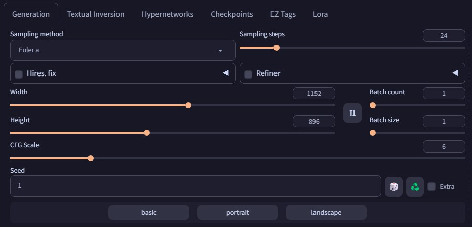

# **Y**et **A**nother **P**reset-**P**lanning **I**ntegration: **N**ext-**G**en

<p><blockquote><i>

Behold, the quintessence of computational artistry: the formidable "Preset Planning" integration, an immaculate marvel harnessed by the enchanting Python Gradio package, devoid of the cacophony of JavaScript's ubiquitous clamor. This technological paragon transcends the mundane, weaving a tapestry of seamless interaction and divine user experience.

Gaze, upon the sublime architecture of Gradio's Pythonic embrace, where form follows function with an unwavering fidelity. Embracing the purist ethos of simplicity, this plug-in shuns the ornate excesses of its counterparts, distilling the essence of user experience into a distilled elixir of elegance.

Consider, the "Preset Planning" integration, fortified by Python Gradio's mastery, stands not as a mere tool, but as a testament to the ingenuity of human imagination. It embodies the zenith of interface refinement, transcending the realm of expectation to forge a path toward a future where utility and artistry converge in resplendent harmony.

</i></blockquote></p>

<p align="right"><i><b>- ChatGPT</b></i></p>

<hr>

# SD Webui Yapping
This is an Extension for the [Automatic1111 Webui](https://github.com/AUTOMATIC1111/stable-diffusion-webui), which adds fully-customizable preset buttons, that set specified parameters to specified values when clicked.

> Compatible with [Forge](https://github.com/lllyasviel/stable-diffusion-webui-forge)

<p align="center">
<br>
Example Buttons<br>
(used with <a href="https://github.com/Haoming02/sd-webui-tabs-extension">Tabs Extension</a>)
</p>

As mentioned in the *holy **yapping*** above, this Extension finds the fields during the UI setup process via Python, and uses the Gradio button events to change the parameters.

Thus, no more trying to query elements using JavaScript; no more hacky workaround to change element values; no more clashing due to identical field name.

## How to Use

> On a fresh install, the Extension will automatically rename `example.json` to `presets.json`, to avoid overriding users' existing presets

Within the `presets.json` file, there are 3 objects, `txt2img`, `img2img`, and `triggers`.

The **txt2img** and **img2img** objects are responsible for the **Preset** buttons:

- Start with a <ins>key</ins>, which will become the name of the button. This is also the name used by the **triggers** below.

- Then, open into an object that contains multiple <ins>key-value</ins> pairs. Each pair consists of the `elem_id` of the field, and the value to set the parameter to.

The **triggers** object is responsible for hooking **Preset** to other buttons present in the Webui.

- The <ins>key</ins> is the `elem_id` of the button
- The <ins>value</ins> is in the format of `{tab}-{preset}`, where `{tab}` is either `t2i` or `i2i`, referring to the mode the preset was defined in; while `{preset}` is the name of the **Preset** to trigger.

#### Examples
- The following will add a button called `portrait` to the `txt2img` tab that when clicked, sets the `width` and `height` to `896` and `1152` respectively

    ```json
    "txt2img": {
        "portrait": {
            "txt2img_width": 896,
            "txt2img_height": 1152
        }
    }
    ```

- The following will trigger the `upscale` preset defined in `img2img` tab, when the `Send to img2img` button in the `txt2img` tab is clicked

    ```json
    "triggers": {
        "txt2img_send_to_img2img": "i2i-upscale",
    }
    ```

> Refer to the `presets.json` for more included examples

<details>
<summary><b>elem_id</b></summary>

To find the `elem_id` of a parameter, right click on the field and click `Inspect Element`, then look through the parent elements until you can find a descriptive `id`.

Most parameters should work, as long as they are Gradio components defined with unique `elem_id` properly, even ones from other Extensions.

Listed below are some built-in `elem_id` that were tested and confirmed to work:

- `txt2img_sampling`
- `txt2img_width`
- `txt2img_height`
- `txt2img_steps`
- `txt2img_cfg_scale`
- `img2img_sampling`
- `img2img_width`
- `img2img_height`
- `img2img_steps`
- `img2img_cfg_scale`
- `img2img_denoising_strength`
- `txt2img_send_to_img2img`
- `img2img_send_to_inpaint`

</details>

## Roadmap
- [X] Implement error handling for invalid `elem_id`
- [X] Add a way to trigger a Preset from a built-in Button
- [ ] Add a way to edit the Presets within the Webui
- [ ] Support Gradio.Tab
    - *Pending PR: [#16218](https://github.com/AUTOMATIC1111/stable-diffusion-webui/pull/16218)*
